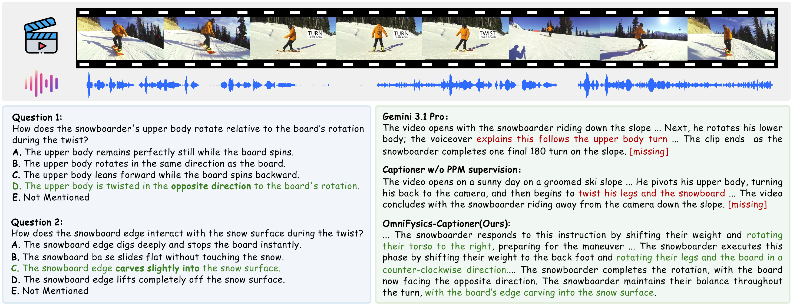
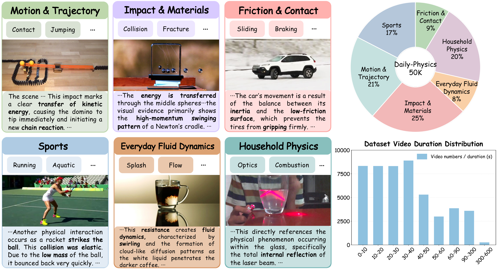
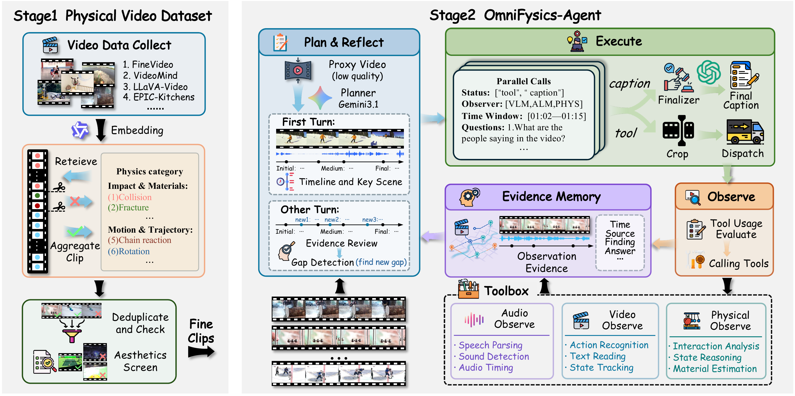
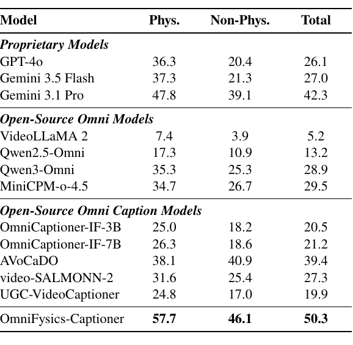

# OmniFysics-Captioner: Grounding Omni-Modal Understanding in the Physical World for Better Captioning

<p align="center">
  <a href="#paper">📄 Paper</a> •
  <a href="https://github.com/Fysics-AI/OmniFysics-Captioner">🌐 Project Page</a> •
  <a href="https://huggingface.co/datasets/Fysics-AI/OmniPhysics-Caption_benchmark">📊 OPC benchmark &amp; Dataset</a> •
  <a href="https://huggingface.co/Fysics-AI/OmniFysics-Captioner">🤗 Model</a> •
  <a href="#citation">📚 Citation</a>
</p>

---

## Introduction

Building omni-modal models with physical intelligence requires fine-grained supervision that captures physical evidence such as contact, support, deformation, and state transitions. **OmniFysics-Captioner** is an end-to-end, tool-free omni-modal Captioner that produces physics-aware audiovisual captions. It reads raw audio and video in a single forward pass and directly generates captions that describe not only what happens, but also which objects interact, how materials respond, and how states change over time.

**[🤗 Fysics-AI/OmniFysics-Captioner](https://huggingface.co/Fysics-AI/OmniFysics-Captioner)**

In addition, we introduce the following supporting components:

- **📊 Dataset — Daily-Physics 50K:** approximately 50K physics-rich video–caption pairs spanning six physical-event categories and 23 observable subcategories, used to supervise the end-to-end model. A 1,000-video training subset is now available at [🔗 Fysics-AI/OmniPhysics-Caption_benchmark/tree/main/media/train](https://huggingface.co/datasets/Fysics-AI/OmniPhysics-Caption_benchmark/tree/main/media/train).
- **🕵️ Agent — OmniFysics-Agent:** an active-perception agent that first builds a coarse event timeline, then coordinates audio, visual, and physical-perception tools over localized time windows to collect spatiotemporally aligned and traceable cross-modal evidence. Within the Agent, a **physical perception model (PPM)** — fine-tuned on approximately 2M image-level samples — serves as a dedicated tool for perceiving physical cues such as material, contact, and deformation, and for extracting object-interaction and state-change cues. Available at [🔗 Fysics-AI/OmniFysics-Captioner/tree/main/PPM](https://huggingface.co/Fysics-AI/OmniFysics-Captioner/tree/main/PPM).
- **📈 Benchmark — OPC (OmniPhysCap):** a physics-aware, omission-aware benchmark with 1,000 audiovisual clips and 8,000 questions for evaluating whether generated captions retain physical events, object interactions, material responses, state transitions, and cross-modal evidence. Available at [🔗 Fysics-AI/OmniPhysics-Caption_benchmark](https://huggingface.co/datasets/Fysics-AI/OmniPhysics-Caption_benchmark).

## Overview

The framework connects physics-rich data construction, active multimodal perception, and tool-free caption generation. Category-aware temporal retrieval identifies clips with observable physical processes. The Agent then gathers source-attributed evidence from localized intervals, and the end-to-end Captioner learns to produce detailed captions directly from audiovisual input.

<p align="center">
  
</p>

## Daily-Physics 50K

Daily-Physics 50K is constructed from heterogeneous audiovisual sources through category-aware temporal anchors, clip verification, deduplication, and quality screening. It covers both short-duration clips centered on localized physical interactions and longer videos containing extended physical dynamics, state transitions, and multi-stage processes.

<p align="center">
  
</p>

## OmniFysics-Agent

OmniFysics-Agent builds a coarse event timeline, identifies intervals that need closer inspection, and routes them to modality-specific observers. The PPM is a dedicated physical-perception tool that examines representative frames, identifies salient objects, and analyzes material properties, contact and support relations, deformation, motion, object interactions, state changes, and likely outcomes. Its object-centric evidence complements audio and visual observations before a finalizer aggregates all evidence into a temporally coherent caption.

<p align="center">
  
</p>

### Tool: Physical Perception Model (PPM)

PPM is a dedicated **tool** inside OmniFysics-Agent that serves as the physical-perception observer. It analyzes representative images for object properties, material, contact, support, deformation, motion, interaction relations, and likely state changes or outcomes. Its object-centric evidence complements the observations of other modality-specific observers.

The released PPM checkpoint is available on Hugging Face:

**[🤗 Fysics-AI/OmniFysics-Captioner/PPM](https://huggingface.co/Fysics-AI/OmniFysics-Captioner/tree/main/PPM)**

## OPC benchmark &amp; Dataset

OmniPhysCap (OPC) is a physics-aware benchmark designed specifically to evaluate captions of physical events in audiovisual videos. It measures whether a generated caption recovers what happens, which objects interact, how materials respond, and what state or outcome follows. The benchmark contains 1,000 videos and 8,000 questions spanning physical interactions and outcomes, together with complementary visual, audio, audiovisual-alignment, temporal, speech, and OCR information.

<p align="center">
  
</p>

The benchmark and dataset are available on Hugging Face:

**[📊 Fysics-AI/OmniPhysics-Caption_benchmark](https://huggingface.co/datasets/Fysics-AI/OmniPhysics-Caption_benchmark)**

The current release contains the OPC benchmark together with a 1,000-video training subset sampled from Daily-Physics 50K. The complete Daily-Physics 50K release will be linked here when available.

## Model

### OmniFysics-Captioner

The full tool-free audiovisual captioning model: **Coming soon**.

The future release will include model identifiers, supported input formats, inference instructions, hardware requirements, and the applicable model license.

## Paper

Paper and supplementary material: **Coming soon**.

## Citation

```bibtex
@article{qiu2026omnifysicscaptioner,
  title   = {OmniFysics-Captioner: Grounding Omni-Modal Understanding in the Physical World for Better Captioning},
  author  = {Qiu, Kaixiang and Han, Minghao and Liu, Keliang and Liu, Yizhou and Han, Jinghang and Jiang, Yue and Wang, Shunli and Zhang, Lihua and Yang, Dingkang},
  journal = {arXiv preprint},
  year    = {2026}
}
```

## License

The content of this repository is released under the Apache License 2.0 with an additional **non-commercial** restriction: it may be used, reproduced, and distributed for research and educational purposes only. Any commercial use is prohibited without prior written permission from the maintainers. Source videos remain subject to the licenses of their original datasets.
